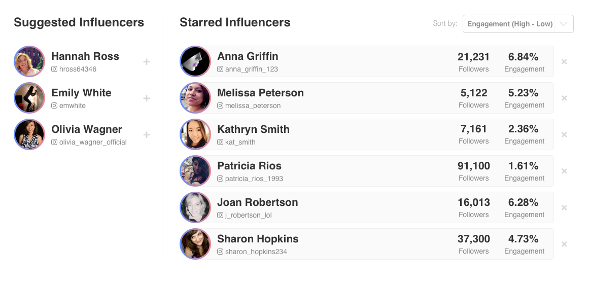

# Influencer Dashboard



Written in React (and Redux), this demo uses an integrated dummy json-server to demonstrate API calls.
Working demo on my personal server: http://193.234.225.105:3000/


To run the application on your local machine

a) check out this repo

```
git clone https://github.com/mapleleafjack/Influencer Influencer
cd Influencer
```

b) Make sure that you're using the latest npm/node version and json-server
```
npm install -g json-server
```

c) Run the main application this way:
```
npm install  #install dependencies
npm start
```

d) In another terminal, run the dummy JSON server
```
node server.js
```
